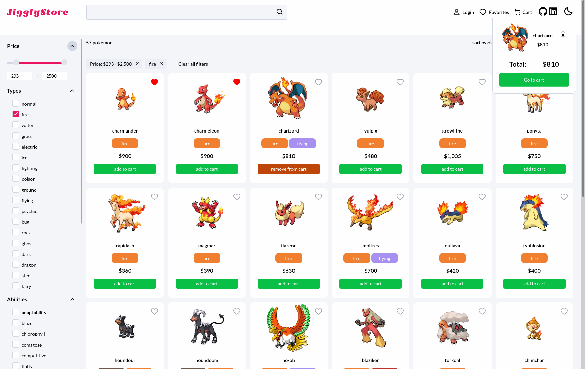

### JigglyStore :grinning:

JigglyStore is your favorite local Pokemon store, developed as a way to showcase my skills in web development. This project utilizes the latest technologies and follows best practices for an optimized user experience.

#### Demo: Experience the JigglyStore in action

#### Technology Stack

React, Next.js, Styled-components and Recoil

#### Features :sparkles:

- Dark mode :waxing_crescent_moon:
- Favorite pokemon, together with a modal to view them :hearts:
- Multiple filters :pushpin:
- Different sorting methods :telescope:
- Responsive website :dancer:

#### Future Improvements :construction:

- Login and authentication :key:
- Checkout and payment processing :credit_card:

#### Contact Information
email: elmer.lingestal@live.se
linkeldn: [www.linkeldn.com](https://www.linkedin.com/in/elmer-lingest%C3%A5l-3571021a8/)

#### Acknowledgements

Data sourced from the [Pokeapi](https://pokeapi.co/).
